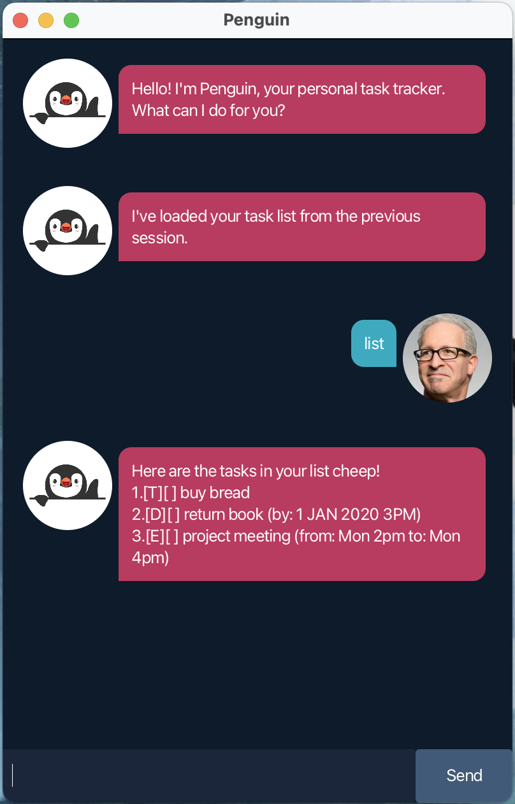

# 🐧 Penguin – Task List CLI Application



Penguin is a lightweight desktop Command Line Interface (CLI) task manager that helps you keep track of your tasks quickly and efficiently.

It supports todos, deadlines, and events — all managed through simple text commands

## 🚀 Getting Started
### 1. Requirements
- Java 17 or later installed

Check your Java version:
```
java -version
```

### 2. Running the Application
```
java -jar penguin.jar
```

After launching, you will see Penguin’s welcome message.

You can now start entering commands.

## 💾 Data Storage
- Tasks are automatically saved
- Data persists between sessions.
- The date file can be found in `Penguin.txt`, as such:
```
project-root/
└── data/
    └── Penguin.txt
└── penguin.jar
```
- Do not manually modify the data file unless necessary.

## 📌 Features
- Add Todo tasks
- Add Deadline tasks
- Add Event tasks
- Mark tasks as done / undone
- Delete tasks
- Find tasks by keyword
- Persistent storage (tasks are saved automatically)
- Simple and fast CLI interaction

## 📖 Command Format
- Commands are case-sensitive.
- Words in < > are parameters you provide.
    - Do not include < > when typing commands.

## 📝 Commands
### 1. Add a Todo
- Adds a simple task.
- Format: `todo <description>`

Example:
```
todo homework
```

### 2. Add a Deadline
- Adds a task with a deadline.
- Format: `deadline <description> /by <date time>`
    - only `yyyy-mm-dd HHmm` accepted for `<date time>`

Example:
```
deadline return book /by 20-01-2026 1500
```

### 3. Add an Event
- Adds a task with a start and end time.
- Format: `event <description> /from <start> /to <end>`

Example:
```
event project meeting /from Mon /to Wed
```

### 4. List all Tasks
- Displays all tasks.

Example:
```
list
```

### 5. Mark Done
- Marks a task as done.
- Format: `mark <number>`

Example:
```
mark 1
```

### 6. Mark Undone
- Marks a task as undone.
- Format: `unmark <number>`

Example:
```
unmark 1
```

### 7. Delete
- Deletes a task.
- Format: `delete <number>`

Example:
```
delete 1
```

### 8. Find Tasks
- Search tasks by one or more keywords.
- Format: `find <keywords>`

Example:
```
find return book
```

### 9. Help
- Get information about all commands.
```
help
```

### 10. Exit Application
- Closes Penguin safely

```
bye
```

## 📊 Command Summary Table

| Command  | Format                                        | Example                                           |
|----------|-----------------------------------------------|---------------------------------------------------|
| Todo     | `todo <description>`                          | `todo read book`                                  |
| Deadline | `deadline <description> /by <date time>`      | `deadline return book /by 2024-12-31 1800`        |
| Event    | `event <description> /from <start> /to <end>` | `event project meeting /from Mon 2pm /to Mon 4pm` |
| List     | `list`                                        | `list`                                            |
| Mark     | `mark <index>`                                | `mark 1`                                          |
| Unmark   | `unmark <index>`                              | `unmark 1`                                        |
| Find     | `find <keyword>`                              | `find book`                                       |
| Delete   | `delete <index>`                              | `delete 3`                                        |
| Help     | `help`                                        | `help`                                            |
| Exit     | `bye`                                         | `bye`                                             |
